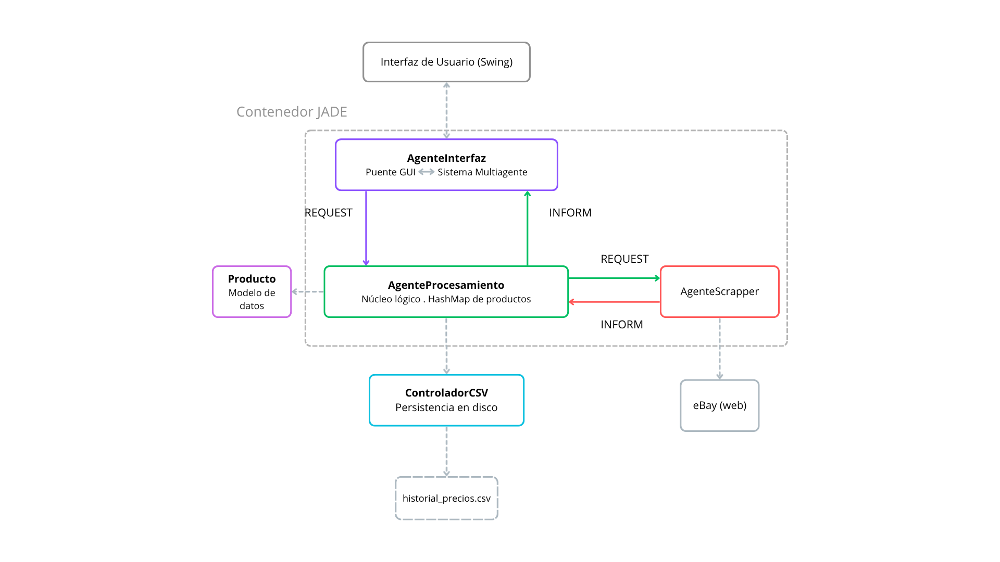

# Price Scraper — Sistema Multiagente con JADE

Monitor inteligente de precios basado en un Sistema Multiagente (SMA) implementado con el framework JADE. La aplicación permite rastrear el precio de productos en tiempo real, guardar el historial y recibir alertas visuales cuando el precio cae por debajo de un umbral definido por el usuario.

## Requisitos previos

Antes de instalar el proyecto, asegúrate de tener lo siguiente:

- **Java 11+** — el proyecto compila con `source/target 11` (ver `pom.xml`)
- **Apache Maven 3.6+** — para gestión de dependencias y ejecución
- Conexión a internet (descarga de dependencias Maven y binarios de Playwright en el primer arranque)

Verificar versiones instaladas:

```bash
java -version
mvn -version
```

---

 ## Instalación
1. Clonar el repositorio
```bash
git clone https://github.com/USUARIO/Sistemas_Inteligentes.git
cd Sistemas_Inteligentes
```

2. Instalar JADE manualmente
Instálalo en tu repositorio Maven local ejecutando este comando desde la raíz del proyecto.

Windows:
```bash
mvn install:install-file "-Dfile=lib/jade.jar" "-DgroupId=com.tilab.jade" "-DartifactId=jade" "-Dversion=4.6.0" "-Dpackaging=jar"
```
  Linux / macOS:
```bash
bashmvn install:install-file -Dfile=lib/jade.jar -DgroupId=com.tilab.jade -DartifactId=jade -Dversion=4.6.0 -Dpackaging=jar
```
Deberías ver BUILD SUCCESS.

3. Descargar el resto de dependencias
```bash
mvn clean install -DskipTests
```
Playwright descarga el navegador Chromium automáticamente la primera vez que se ejecuta la aplicación. No se necesita ningún paso adicional.
En caso de que no se descargue correctamente ejecutar esto:
```bash
mvn exec:java "-Dexec.mainClass=com.microsoft.playwright.CLI" "-Dexec.args=install chromium"
```
## Dependencias
Todas las dependencias están declaradas en `pom.xml` y se gestionan con Maven:

| Dependencia | Versión | Uso |
|-------------|---------|-----|
| [JADE](https://jade.tilab.com/) | 4.6.0 | Framework del sistema multiagente (FIPA) |
| [Playwright](https://playwright.dev/java/) | 1.44.0 | Navegador headless para web scraping |
| [JFreeChart](https://www.jfree.org/jfreechart/) | 1.5.4 | Gráficas de evolución de precios |
| [org.json](https://github.com/stleary/JSON-java) | 20240303 | Procesamiento de JSON |

> **Nota:** JADE se descarga desde el repositorio Maven de TILab (`https://jade.tilab.com/maven/`), que está declarado en el `pom.xml`. No hace falta añadirlo manualmente.

---

## Ejecución

Desde la raíz del proyecto, lanzar la plataforma JADE con los tres agentes:
```bash
mvn clean compile
```
```bash
mvn exec:java
```
Esto ejecuta el comando configurado en el `pom.xml`

Al arrancar correctamente verás en consola:

```
Agente Procesamiento registrado correctamente en el DF.
Agente Interfaz registrado correctamente en el DF.
Agente Percepcion-webScrapping registrado correctamente en el DF.
```

Y al salir: 
```
Agente Procesamiento desregistrado del DF.
Agente Interfaz desregistrado del DF.
Agente Percepcion desregistrado del DF.
```
Se abrirán dos ventanas: la **GUI de administración de JADE** y la ventana principal de la aplicación **Price Scraper**.

## Datos de ejemplo para la ejecución de la práctica

Para probar el correcto funcionamiento del sistema, la extracción de datos mediante web scrapping y la lógica de alertas del Agente de Procesamiento, se recomienda utilizar los siguientes datos de ejemplo en el formulario de la interfaz gráfica:

**Monitor Gaming** 
* **Umbral**: 200.00 eur aprox
* **URL**: https://www.ebay.es/itm/188407383759

**Tarjeta Gráfica** 
* **Umbral**: 225.00 eur aprox
* **URL**: https://www.ebay.es/itm/397948401953

**Ratón** 
* **Umbral**: 30.00eur aprox.
* **URL**: https://www.ebay.es/itm/178161783338

**Smartphone** 
* **Umbral**: 165.00 eur aprox
* **URL**: https://www.ebay.es/itm/397977260320

**Tarjeta microsd** 
* **Umbral**: 6.00 eur aprox
* **URL**: https://www.ebay.es/itm/287121715784

---

## Diagrama de la Arquitectura del Sistema


---

## Declaración de uso de IA

De acuerdo con las normativas de la asignatura, declaramos el uso de herramientas de Inteligencia Artificial Generativa (Claude(Anthropic) y Gemini(Google)) como asistente pedagógico y de desarrollo de software durante la realización de este proyecto.

El uso de IA se ha limitado a las siguientes tareas:
* **Ayuda en la creación de GUI que se había diseñado en Figma 
* **Diseño del protocolo de comunicación:** Asistencia para estructurar correctamente los mensajes ACL aplicando las performativas semánticas adecuadas(REQUEST, INFORM, PROPOSE) según el estándar FIPA.
* **Integración de Hilos (JADE vs Swing):** Consulta sobre patrones de diseño seguros para comunicar el Agente de Interfaz con la GUI sin bloquear el *Event Dispatch Thread* de java, implementando 'SwingUtilities.invokeLater'.
* **Optimización de Comportamientos:** Guía en la implementación de comportamientos bloqueantes('MessageTemplate' con 'block()') para evitar la saturación de CPU, y uso de 'TicketBehaviour' para los ciclos de scraping.
* **Resolución de Errores (Debugging):** Ayuda puntual en la corrección de errores de compilación y tipográficos, así como en la comprensión del uso de la interfaz 'Serializable' para el envío de objetos entre contenedores.

La concepción general de la arquitectura, la implementación del scraping con Playwright, el diseño lógico de evaluación de mercado, la persistencia en CSV, el diseño visual de la interfaz y la integración final del código han sido desarrollados íntegramente de forma manual por los miembros del grupo.

---

## Autores
* Daniel Zhan - ByTatami43
* Gabriel Samuel Vigil Rodríguez - ChambaVigil
* Nicolás Cidoncha Rodríguez de la Flor - Zumooo
* Lucas Lillo Ramírez - Ldelillo
* Jose Manuel Iglesias Molina - jm-iglesias

